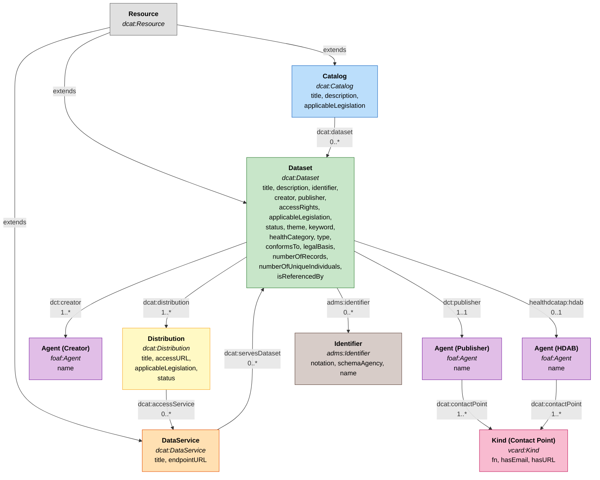

<!--
SPDX-FileCopyrightText: 2024 Health-RI.

SPDX-License-Identifier: CC-BY-4.0
-->

# GDI Metadata Model Overview

## Class Relationships

## Namespaces

### Core Data Cataloguing

| Prefix | Full URI | Description |
|---|---|---|
| **dcat** | `http://www.w3.org/ns/dcat#` | **Data Catalog Vocabulary** — W3C standard for describing datasets, distributions, data services, and catalogues. The backbone of the model (including `keyword`). |
| **dct** | `http://purl.org/dc/terms/` | **Dublin Core Terms** — widely-used vocabulary for generic metadata properties like `title`, `description`, `identifier`, `creator`, `publisher`, `type`, `accessRights`, `conformsTo`. |
| **dcatap** | `http://data.europa.eu/r5r/` | **DCAT Application Profile for data portals in Europe** — EU-specific extensions to DCAT, e.g. `applicableLegislation`. |

### Health-Specific

| Prefix | Full URI | Description |
|---|---|---|
| **healthdcatap** | `http://healthdataportal.eu/ns/health#` | **HealthDCAT-AP** — health-sector extension of DCAT-AP, adding properties like `hdab` (Health Data Access Body), `healthCategory`, `numberOfRecords`, `numberOfUniqueIndividuals`. |

### Agents and Contacts

| Prefix | Full URI | Description |
|---|---|---|
| **foaf** | `http://xmlns.com/foaf/0.1/` | **Friend of a Friend** — vocabulary for describing people and organisations. Used for `foaf:Agent` (creator, HDAB) and `foaf:name`. |
| **vcard** | `http://www.w3.org/2006/vcard/ns#` | **vCard ontology** — models contact information (email, name, URL). Used for `vcard:Kind` contact points on the HDAB agent. |

### Identifiers and Asset Description

| Prefix | Full URI | Description |
|---|---|---|
| **adms** | `http://www.w3.org/ns/adms#` | **Asset Description Metadata Schema** — EU vocabulary for describing reusable assets. Used for `adms:Identifier` (secondary identifiers), `adms:schemaAgency`, and `adms:status` on dataset and distribution records. |
| **skos** | `http://www.w3.org/2004/02/skos/core#` | **Simple Knowledge Organization System** — for controlled vocabularies and concept schemes. Used for `skos:Concept` (health categories, themes) and `skos:notation` (identifier strings). |

### Legal and Privacy

| Prefix | Full URI | Description |
|---|---|---|
| **dpv** | `https://w3id.org/dpv#` | **Data Privacy Vocabulary** — W3C vocabulary for describing personal data processing. Used for `dpv:hasLegalBasis` (e.g. consent). |
| **eli** | `http://data.europa.eu/eli/ontology#` | **European Legislation Identifier** — for referencing EU legislation. The EHDS regulation ELI is used as the default `applicableLegislation` value. |

### Shapes and Validation

| Prefix | Full URI | Description |
|---|---|---|
| **sh** | `http://www.w3.org/ns/shacl#` | **Shapes Constraint Language** — W3C standard for validating RDF graphs. All the `.ttl` files define `sh:NodeShape` constraints (min/max counts, patterns, allowed values, etc.). |
| **dash** | `http://datashapes.org/dash#` | **DASH Data Shapes** — extensions to SHACL providing UI hints like `dash:EnumSelectEditor`, `dash:TextFieldEditor`, `dash:URIViewer`. These tell the FDP how to render form fields. |

### Foundational RDF/OWL

| Prefix | Full URI | Description |
|---|---|---|
| **rdf** | `http://www.w3.org/1999/02/22-rdf-syntax-ns#` | Core RDF syntax (lists, types). |
| **rdfs** | `http://www.w3.org/2000/01/rdf-schema#` | RDF Schema — `label`, `comment`, `Literal`, `Resource`. |
| **owl** | `http://www.w3.org/2002/07/owl#` | Web Ontology Language — used to declare ontology metadata and versioning. |
| **xsd** | `http://www.w3.org/2001/XMLSchema#` | XML Schema datatypes — `xsd:string`, `xsd:nonNegativeInteger`, `xsd:dateTime`. |

### Project-Specific

| Prefix | Full URI | Description |
|---|---|---|
| **gdi** | `http://data.gdi.eu/core/p2/` | **GDI's own namespace** — for shapes (`DatasetShape`, `CatalogShape`, etc.) and project-specific concepts/properties like `gdi:1MGCompliant` and `gdi:HealthCategoryHumanGenomic`. |
